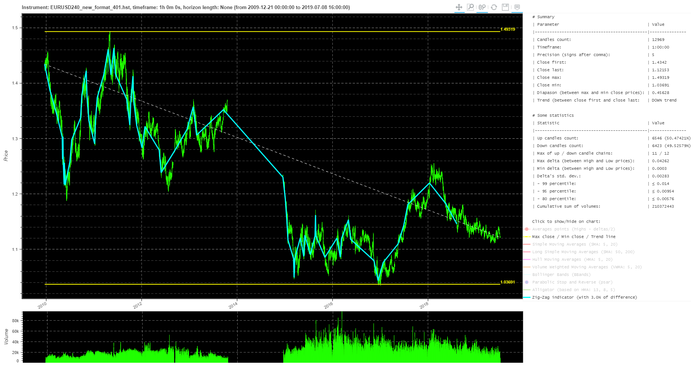

# MT4ForexParser

[](https://travis-ci.com/Tim55667757/MT4ForexParser)
[](https://pypi.python.org/pypi/MT4ForexParser)
[](https://github.com/Tim55667757/MT4ForexParser/blob/master/LICENSE)

All traders sometimes need to get historical data on Forex currencies for further price analysis and charting. Most often this data is supplied for paid or you have to spend a lot of time manually uploading data from special sites.

However, most Forex brokers work with the MetaTrader 4 trading platform and upload data there in a special binary MetaTrader 4 .hst format (not in .csv). You can use a trick and get historical candles by connecting to the broker's server in demo mode, which almost all brokers have. The compressed binary .hst file will be downloaded locally to the MetaTrader 4 working directory.

Then you can run the mt4forexparser python module, which can read .hst files and save them as a text .csv file or pandas dataframe. You will get a table that contains columns of data in the following sequence: "date", "time", "open", "high", "low", "close", "volume". One line is a set of data for plotting one candlestick.

See russian readme here (инструкция на русском здесь): https://github.com/Tim55667757/MT4ForexParser/blob/master/README_RU.md


## Setup

The easiest way is to install via PyPI:
```commandline
pip install mt4forexparser
```

After that, you can check the installation with the command:
```commandline
pip show mt4forexparser
```


## Usage examples

### From the command line

Get help:
```commandline
mt4forexparser --help
```

Output:
```
usage: python MT4ForexParser.py [some options] [one command]

Metatrader 4 forex history parser. Read, parse and save history as .csv-file
or pandas dataframe. Also you can draw an interactive chart. See examples:
https://tim55667757.github.io/MT4ForexParser

optional arguments:
  -h, --help            show this help message and exit
  --mt4-history MT4_HISTORY
                        Option (required): full path to Metatrader 4 forex
                        history file.
  --output OUTPUT       Option: full path to .csv output file. Default is
                        None, mean that returns only pandas dataframe.
  --debug-level DEBUG_LEVEL
                        Option: showing STDOUT messages of minimal debug
                        level, e.g. 10 = DEBUG, 20 = INFO, 30 = WARNING,
                        40 = ERROR, 50 = CRITICAL.
  --parse               Command: read, parse and save mt4-history as pandas
                        dataframe or .csv-file if --output is define.
  --render              Command: use PriceGenerator module to render
                        interactive chart from parsed data. This key only used
                        with --parse key.
```


.hst-file formats are supported in two versions: 400 and 401 and are automatically detected. Try to check how the parser work through the command line using two attached files of different formats: ./tests/EURUSD240_old_format_400.hst and ./tests/EURUSD240_new_format_401.hst.

The command could be like this:
```commandline
mt4forexparser --mt4-history ./tests/EURUSD240_old_format_400.hst --output ./tests/EURUSD240_old_format_400.csv --debug-level 10 --parse
```

If successful, you should get a log output similar to the following:
```
MT4ForexParser.py   L:118  DEBUG   [2020-07-21 20:47:00,134] MT4 parser started: 2020-07-21 20:47:00
MT4ForexParser.py   L:38   DEBUG   [2020-07-21 20:47:00,134] MT4 history file: [./tests/EURUSD240_old_format_400.hst]
MT4ForexParser.py   L:42   DEBUG   [2020-07-21 20:47:00,171] MT4 history file format version: [400]
MT4ForexParser.py   L:63   INFO    [2020-07-21 20:47:00,334] It was read 5909 rows from file [./tests/EURUSD240_old_format_400.hst]
MT4ForexParser.py   L:64   INFO    [2020-07-21 20:47:00,334] Showing last 3 rows:
MT4ForexParser.py   L:69   INFO    [2020-07-21 20:47:00,339]             date   time     open     high      low    close  volume
MT4ForexParser.py   L:69   INFO    [2020-07-21 20:47:00,339] 5906  2013.10.18  12:00  1.36918  1.37036  1.36690  1.36780    8193
MT4ForexParser.py   L:69   INFO    [2020-07-21 20:47:00,340] 5907  2013.10.18  16:00  1.36779  1.36993  1.36773  1.36795    6639
MT4ForexParser.py   L:69   INFO    [2020-07-21 20:47:00,340] 5908  2013.10.18  20:00  1.36793  1.36849  1.36765  1.36839    1955
MT4ForexParser.py   L:73   INFO    [2020-07-21 20:47:00,383] Forex history saved to .csv-formatted file [./tests/EURUSD240_old_format_400.csv]
MT4ForexParser.py   L:148  DEBUG   [2020-07-21 20:47:00,384] All MT4 parser operations are finished success (summary code is 0).
MT4ForexParser.py   L:153  DEBUG   [2020-07-21 20:47:00,384] MT4 parser work duration: 0:00:00.249747
MT4ForexParser.py   L:154  DEBUG   [2020-07-21 20:47:00,384] MT4 parser work finished: 2020-07-21 20:47:00
```

This will give you file ./tests/EURUSD240_old_format_400.csv with the following content (5909 lines in total):
```
2009.12.21,00:00,1.4311,1.4347,1.4311,1.4342,5504
2009.12.21,04:00,1.4342,1.4357,1.4327,1.4334,5234
2009.12.21,08:00,1.4334,1.4342,1.428,1.4337,8366
...
2013.10.18,12:00,1.36918,1.37036,1.3669,1.3678,8193
2013.10.18,16:00,1.36779,1.36993,1.36773,1.36795,6639
2013.10.18,20:00,1.36793,1.36849,1.36765,1.36839,1955
```

Likewise for parsing a file with new format:
```commandline
mt4forexparser --mt4-history ./tests/EURUSD240_new_format_401.hst --output ./tests/EURUSD240_new_format_401.csv --debug-level 10 --parse
```

If successful, you will receive something like this output:
```
MT4ForexParser.py   L:118  DEBUG   [2020-07-21 20:55:42,594] MT4 parser started: 2020-07-21 20:55:42
MT4ForexParser.py   L:38   DEBUG   [2020-07-21 20:55:42,595] MT4 history file: [./tests/EURUSD240_new_format_401.hst]
MT4ForexParser.py   L:42   DEBUG   [2020-07-21 20:55:42,675] MT4 history file format version: [401]
MT4ForexParser.py   L:63   INFO    [2020-07-21 20:55:43,098] It was read 12969 rows from file [./tests/EURUSD240_new_format_401.hst]
MT4ForexParser.py   L:64   INFO    [2020-07-21 20:55:43,099] Showing last 3 rows:
MT4ForexParser.py   L:69   INFO    [2020-07-21 20:55:43,103]              date   time     open     high      low    close  volume
MT4ForexParser.py   L:69   INFO    [2020-07-21 20:55:43,104] 12966  2019.07.08  08:00  1.12305  1.12339  1.12190  1.12310    8894
MT4ForexParser.py   L:69   INFO    [2020-07-21 20:55:43,104] 12967  2019.07.08  12:00  1.12309  1.12322  1.12123  1.12228    9257
MT4ForexParser.py   L:69   INFO    [2020-07-21 20:55:43,104] 12968  2019.07.08  16:00  1.12228  1.12240  1.12091  1.12153    7381
MT4ForexParser.py   L:73   INFO    [2020-07-21 20:55:43,187] Forex history saved to .csv-formatted file [./tests/EURUSD240_new_format_401.csv]
MT4ForexParser.py   L:148  DEBUG   [2020-07-21 20:55:43,188] All MT4 parser operations are finished success (summary code is 0).
MT4ForexParser.py   L:153  DEBUG   [2020-07-21 20:55:43,188] MT4 parser work duration: 0:00:00.594304
MT4ForexParser.py   L:154  DEBUG   [2020-07-21 20:55:43,189] MT4 parser work finished: 2020-07-21 20:55:43
```

The file ./tests/EURUSD240_new_format_401.csv will be completely similar and include the same columns: "date", "time", "open", "high", "low", "close", "volume" (total 12969 lines):
```
2009.12.21,00:00,1.4311,1.4347,1.4311,1.4342,5504
2009.12.21,04:00,1.4342,1.4357,1.4327,1.4334,5234
2009.12.21,08:00,1.4334,1.4342,1.428,1.4337,8366
...
2019.07.08,08:00,1.12305,1.12339,1.1219,1.1231,8894
2019.07.08,12:00,1.12309,1.12322,1.12123,1.12228,9257
2019.07.08,16:00,1.12228,1.1224,1.12091,1.12153,7381
```

Also, you can draw an interactive chart (see: [PriceGenerator](https://github.com/Tim55667757/PriceGenerator) library) using `--render` key after `--parse` key:
```commandline
mt4forexparser --mt4-history ./tests/EURUSD240_new_format_401.hst --output test.csv --parse --render
```

After running the command above, you will get three files:
- `test.csv` — .csv-file containing prices (example: [./media/test.csv](./media/test.csv));
- `index.html` — price chart and statistics drawn using the Bokeh library and saved to an .html-file (example: [./media/index.html](./media/index.html));
- `index.html.md` — statistics as simple text, saved in markdown format (example: [./media/index.html.md](./media/index.html.md)).




### Using import

Let's look an example of parsing a history file of a new format (version 401 for MetaTrader 4) ./tests/EURUSD240_new_format_401.hst:
```
from mt4forexparser.MT4ForexParser import MT4ParseToPD as Parser

# Parsing historical candles and save the data into a pandas dataframe variable.
# To save candles to a file, you can specify the variable outputFile="./tests/EURUSD240_new_format_401.csv"
# If the variable outputFile is not specified, the module will only return data in pandas dataframe format.
df = Parser(historyFile="./tests/EURUSD240_new_format_401.hst")
print(df)
```

At run we get a completely similar output:
```
...
>>> print(df)
             date   time     open     high      low    close  volume
0      2009.12.21  00:00  1.43110  1.43470  1.43110  1.43420    5504
1      2009.12.21  04:00  1.43420  1.43570  1.43270  1.43340    5234
2      2009.12.21  08:00  1.43340  1.43420  1.42800  1.43370    8366
3      2009.12.21  12:00  1.43370  1.43710  1.43300  1.43330    8456
4      2009.12.21  16:00  1.43320  1.43350  1.42860  1.42940    8488
...           ...    ...      ...      ...      ...      ...     ...
12964  2019.07.08  00:00  1.12230  1.12293  1.12192  1.12204    3455
12965  2019.07.08  04:00  1.12205  1.12307  1.12203  1.12307    4173
12966  2019.07.08  08:00  1.12305  1.12339  1.12190  1.12310    8894
12967  2019.07.08  12:00  1.12309  1.12322  1.12123  1.12228    9257
12968  2019.07.08  16:00  1.12228  1.12240  1.12091  1.12153    7381
```


I wish you success in the automation of exchange trading! ;)
